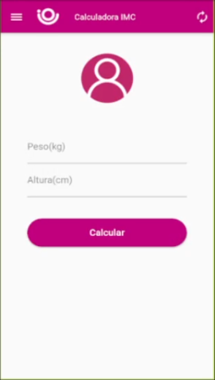
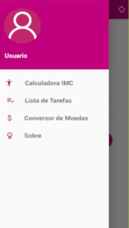
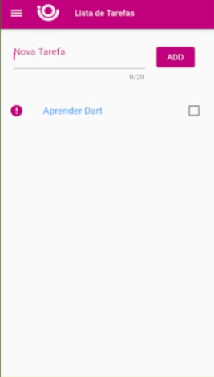

# Desafio Calculadora IMC

## Desafio 1 da trilha de Flutter da ioasys

Imagens do projeto

__Página Home__

__Página Calculadora IMC__

__Página do Menu__

__Página Lista de Tarefas__

__Página Conversor de Moedas__

__Página Sobre__

# Start Here

Para rodar o projeto é necessáro que você tenha, instalado no seu sistema:

* SDK Flutter
* Android Studio (Windows/Linux)
* xCode (MacOs)

Além de uma IDE para inicilizar fácil o emulador com o projeto, indico o Visual Studio Code.

Todo o código, está na pasta "lib/" e todas as imagens "local", está em "assets/images/".